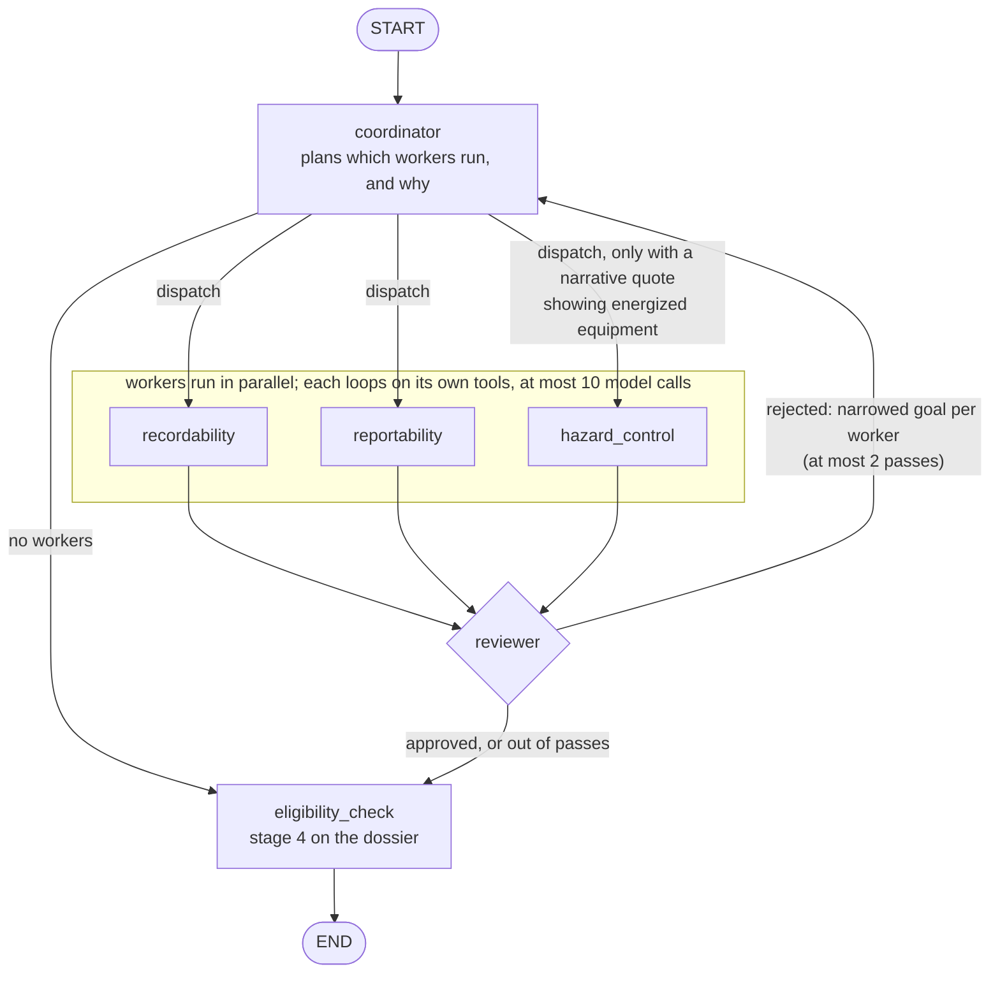

# FieldSight architecture (§16.2)

## Topology

A typed LangGraph `StateGraph` (`graph/graph.py`). Dispatched workers run in parallel; each is its own `agent <-> tools` graph (`graph/specialists.py`).

- **Why orchestrator/worker:** each question needs different tools and corpus sections, and the Coordinator can skip a leg (hazard control runs only when the narrative shows energized equipment).
- **Why not sequential:** recordability and reportability are independent, so a chain doubles the wait and can't re-run one rejected leg on its own.
- **Why not fully concurrent:** without a Coordinator and a Reviewer, nothing decides what runs or checks the result before the analyst sees it.

## Decisions table

| Decision | Value | Unit | Reasoning |
|---|---|---|---|
| max tokens per call: coordinator / each worker / reviewer | 4,096 / 6,144 / 4,096 (`*_max_tokens_per_call`) | tokens | Workers write the longest output. Not yet passed to the model as `max_tokens`; the meter uses 6,144 as a call's worst-case output for the cost check |
| max tool invocations per turn | 54 per turn (`max_tool_invocations_per_turn`); 10 model calls per specialist (`max_specialist_tool_rounds`) | calls / rounds | Per turn: 36 measured x 1.5 (`script/tune_bounds.py`), not yet enforced. Per specialist: enforced hard cap; 5 left workers without a proposal after a rejection |
| max graph recursion depth | 32 (`max_graph_recursion_depth`) | steps | Applies to the Coordinator's graph (longest path 7 steps) and each worker's graph (about 21 steps for 10 rounds); 32 clears both |
| max reviewer iterations | 2 (`max_reviewer_iterations`) | iterations | One rejection and one re-dispatch, then on to the eligibility check. Any rejection escalates |
| max retrieved chunks / tokens | 113 chunks / 25,767 tokens per turn; 8 per search (`FIELDSIGHT_RETRIEVAL_MAX_CHUNKS`), at most 3 hops of 3 chunks, up to 9 chunks per whole letter | chunks / tokens | Per turn: 75 chunks and 17,178 tokens measured x 1.5 (`script/tune_bounds.py`), not yet enforced. Per-search and hop caps are enforced |
| per-turn wall clock / per-call HTTP timeout | 300 (`max_turn_wall_clock_seconds`) / AWS: 5 connect, 30 read, 4 attempts; Gateway 20; STS 3 | s | A turn with a Reviewer rejection took 110 to 170 s, so 120 was too short. The slowest final-run turn took 276 s, so headroom is now under 10% |
| session cost ceiling | 5.00 (`session_cost_ceiling_usd`) | USD | An analyze turn costs about $0.11 and an ask about $0.005 (measured); $5 covers a long session and stops a runaway one |
| near-boundary margin: 24 h clock | 1.0 (`reporting_24h_margin_hours`) | hours | Packet timestamps are often rounded to the hour; escalates at 23 to 25 h inclusive |
| near-boundary margin: 30-day fatality window | 1.0 (`fatality_30d_margin_days`) | days | Dates often lack a time or time zone; escalates at 29 to 31 days inclusive |
| near-boundary margin: 180-day cap | 7 (`log_180d_margin_days`) | days | Return-to-work dates are often stated loosely; escalates at 173 to 187 days inclusive |
| near-boundary margin: 0.60 floor | 0.02 (`confidence_margin_absolute`) | confidence | Escalates at 0.58 to 0.62 inclusive; a starting value, not yet tuned |
| similarity refusal threshold | 0.483 (`FIELDSIGHT_RETRIEVAL_SCORE_THRESHOLD`) | cosine score | Midpoint between answerable (0.490 to 0.800) and out-of-corpus (0.415 to 0.476) top scores; see the evaluation report. Re-tune when chunking changes |
| chunk size / overlap | Part 1904: one paragraph per chunk, 2,600 cap; other documents 1,800 / 300; tables split by rows under their header | chars | One provision per chunk, so citations are checkable at paragraph level. The KB uses chunking NONE so Bedrock doesn't re-split them |
| boundary inclusivity (24 h, 30 days) | Inclusive | | 1904.39(b)(6) says "within"; `rules/reporting.py` excludes only times greater than the limit |
| day-count convention | Calendar days from the day after the injury; the return day isn't counted; days away plus restricted capped at 180 | days | 1904.7(b)(3). The normalizing model counts the days; R4 applies the cap |
| model tier per agent | Reasoning (workers, Reviewer, answers, normalization) and fast (Coordinator, readiness): both DeepSeek V3.2, temperature 0. Photos: Nova Pro. Embeddings: Titan v2 | | Citation accuracy over speed; Nova Pro reads images |
| judge model + version | Nova Pro (`amazon.nova-pro-v1:0`), temperature 0 | | A different model family from the system under test |
| pinned versions | Python 3.14, boto3 1.43.96, langgraph 1.2.11, langgraph-checkpoint-postgres 3.1.2, langchain-aws 1.7.8, pydantic 2.13.5, pydantic-settings 2.15.0, bedrock-agentcore 1.23.1, flask 3.1.2 | | `uv.lock` and `deploy/runtime/runtime-requirements.txt`; base images pinned by sha256 digest |

## Degraded modes

| Failure | Behaviour | What the analyst sees |
|---|---|---|
| Bedrock timeout, 5xx or throttling | Adaptive retry (4 attempts); then the turn ends without a model answer | An error for that turn; nothing is written |
| Textract fails on an artifact | Recorded as a failed artifact; the rest of the packet carries on | The submit summary names it; dependent fields have low or no confidence |
| Retrieval unavailable | Refused as `retrieval_unavailable`; never answered from model knowledge | "The regulatory corpus couldn't be searched" and what was tried |
| Nothing above threshold | Refused as `below_threshold` and logged | "No passage ... scored above the similarity threshold" and what was searched |
| insufficient_data | The rule names the missing field; a classify turn stops at readiness | Routed to the analyst with the missing fields named |
| Structured output fails validation | A worker's proposal is sent back to fix; an answer is refused as `not_grounded` | A refusal, or a dossier leg named as missing |
| Gateway or ECS API unreachable | The read tool returns "unavailable"; never replaced with a local copy | "Unavailable this turn: <tool> (<why>)" |
| Write fails after approval | Approval and write share one transaction, retried 3 times; if all fail, neither is saved | `Refused: Review decision not saved after 3 attempts`; the item stays pending |
| Cost or token ceiling breached | The meter refuses the next model call (cost ceiling or turn clock); the turn is refused as `bound_reached` | "This session's <bound> limit (<value>) is spent"; no dossier |

## What we cut and why

- **A JWT authorizer on the Gateway:** IAM (SigV4) instead, since no long-lived secrets are allowed (accepted risk below).
- **Bedrock's default KB chunking:** it split provisions in half; we chunk ourselves.
- **Regulation-to-letter hops:** a regulation chunk doesn't name the letters about it; workers find them by searching again.
- **Latency work:** answers and dossiers miss their latency targets; we spent the time on grounding and escalation.
- **A separate fast model:** both tiers run DeepSeek; splitting them is a config change.

## Threat and responsible-AI note

### Trust boundaries

| Boundary | What can go wrong | Mitigation or accepted risk |
|---|---|---|
| Analyst input | Prompt injection, action requests, oversized input | Size limits, the Prompt Attacks filter, and a readiness classifier that refuses actions before any worker runs |
| Packet artifacts | Injection in an uploaded note; a misleading photo | Paragraph-level screening withholds attacked text and escalates; confidences come from Textract; a contradicting photo fires a trigger |
| Corpus | A wrong or stale source | A fixed document list (`corpus/sources.json`); no user uploads. Accepted risk: current only to its eCFR issue date |
| Model output | Ungrounded claims, determinations, invented thresholds | Every claim cites a retrieved chunk; every threshold traces to the rules engine or the dossier is blocked; determination language is refused; the Reviewer checks each leg |
| Gateway | A caller acting as another analyst | Accepted risk; see below |
| ECS tool API | Reading an ungranted incident | IAM auth, STS-verified caller proof, and a grant check on every call (`not_entitled`) |
| Database | Injection, over-broad access | Bound parameters via the repository package. Accepted risk until the demo ends: RDS open to 0.0.0.0/0 for testing [team: confirm deployed DB auth] |
| CI/CD | Tampered image, leaked credential | GitHub OIDC roles, gitleaks scan, deploy by sha256 digest |

### Accepted risks
- **Gateway identity posture:** the Gateway authenticates the AWS principal (SigV4), not the analyst. The analyst is verified at the ECS API from a 60-second, thread-bound STS proof, so a leaked proof can be replayed for that window on its thread; proofs are kept out of logs, checkpoints and Postgres.
- **Two-person approver split:** the reviewer must differ from the submitter (`submit_review` and the `ck_review_queue_separate_reviewer` check), but the split is between analyst records: one person holding two enrolled analyst roles could approve their own dossier, so each role's trust policy must admit only its analyst.

### Intended use
A trained OSHA recordkeeping analyst works through an incident packet: FieldSight extracts the facts, runs the rules, finds the provisions and builds a cited dossier. The analyst makes every determination and approves every write.

### Out-of-scope use
- Deciding whether an employer must record or report.
- Anything outside 29 CFR Part 1904 and 1910.269(l); refused, naming what was searched.
- Use without a trained human reviewer.
- Real employee data (all project data is synthetic).

### What each failure costs the analyst
- **A wrong answer that looks grounded:** a missed or late report; the worst case.
- **A refusal on an answerable question:** a manual lookup.
- **A missed escalation:** a case that needed a second look goes through.
- **An unnecessary escalation:** a few minutes of a reviewer's time.
- **An outage:** the turn fails or names the gap; nothing is written.
