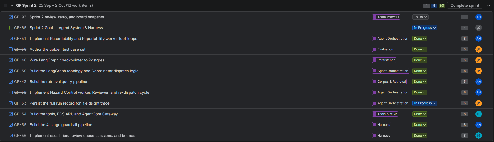

# Sprint 2 Review

## Sprint goal: Agent System & Harness

**Goal met:** Yes (the CLI was deferred to Sprint 3; see *Carried over*)

## Shipped

- The full LangGraph workflow: the Coordinator, three workers, and the Reviewer, including the reject-and-re-dispatch loop
- MCP tools, plus the AgentCore Gateway and the ECS API, running live with entitlement checks
- The four-stage harness (input validation, Prompt Attacks filter, readiness gate, output guardrails) and the escalation triggers
- Sessions and bounds

## Carried over

- **CLI:** deferred to Sprint 3. [One line on why, e.g. the harness and graph had to stabilize first.]

## Demo notes

