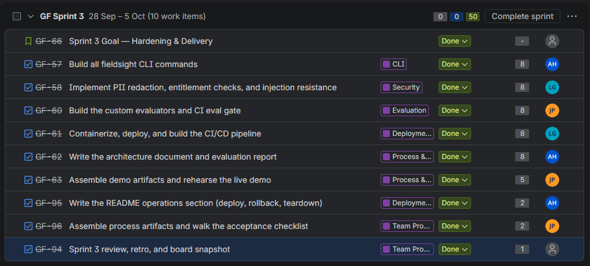

# Sprint 3 review

**Sprint goal (committed at start):** Hardening & delivery: evaluators and CI eval gate complete; injection and entitlement-denial tests demonstrated; both services deployed through CI/CD; external MCP client demo; final judged eval with delta; architecture doc and evaluation report written; demo artifacts committed; live demo rehearsed to time.

**Goal met?** Yes

## Shipped (merged + tested)

- **The CLI, carried over from Sprint 2:** all eight commands (`submit`, `analyze`, `dossier`, `ask`, `sources`, `trace`, `queue`, `review`) run through the full harness.
- **The run record and `trace`:** every turn saves one run record with the Coordinator's plan, tool calls, rule invocations, Reviewer verdicts, and per-call model latency, tokens and cost.
- **Golden-set evaluation with a judge model:** the first judged run passed 3 of 28 cases; after tuning, the final run passed 22 of 28, with refusal recall at 1.0 and refusal precision at 0.67.
- **Tuning fixes from the eval runs:** grounding decisions in exact paragraphs, stopping the Reviewer from disputing verified rule citations, making `ask` answer follow-ups from the existing analysis, and widening the 180-day near-boundary margin.
- **Deployment through CI/CD:** `ci.yml` and `deploy.yml` workflows, the ECS service, and the AgentCore Runtime image. [Confirm both services deployed successfully.]
- **Indirect-injection test:** the poisoned fixture (`adversarial-02`) passes, and the determination is unchanged.

## Not shipped

- Six golden cases still fail, including `adversarial-01` (retrieval enabled), whose correct answer was blocked by the output guardrail.

## Demo notes

